# Student Performance

## Index

- [Problem Statement](#problem-statement)
    - [Technologies](#technologies)
- [Data Preprocessing and Model Training with Mage](#data-preprocessing-and-model-training-with-mage)
- [Inference Pipeline: Model Serving](#inference-pipeline-model-serving)
- [Monitoring: Model Maintenance](#monitoring-model-maintenance)
- [Infrastructure and Automation: Terraform, Infrastructure as Code](#infrastructure-and-automation-terraform-infrastructure-as-code)
- [Development Practices](#development-practices)
    - [Linter and Code Formatters](#linter-and-code-formatters)
    - [Makefile](#makefile)
    - [Precommit hooks](#precommit-hooks)
    - [Tests](#tests)
        - [Unit tests](#unit-tests)
        - [Integration tests](#integration-tests)
- [CI/CD pipeline](#cicd-pipeline)
- [Future steps](#future-steps)


## Problem Statement

### Dataset Source

The dataset for this project is sourced from [Kaggle: Students Performance Dataset](https://www.kaggle.com/datasets/rabieelkharoua/students-performance-dataset).

### Project Objective

The primary goal of this project is to develop a predictive model to classify students' grades into distinct categories. This classification will leverage various features such as parental involvement, extracurricular activities, and academic performance. The insights gained from this model aim to provide guidelines for understanding and improving student outcomes.

### Project Implementation

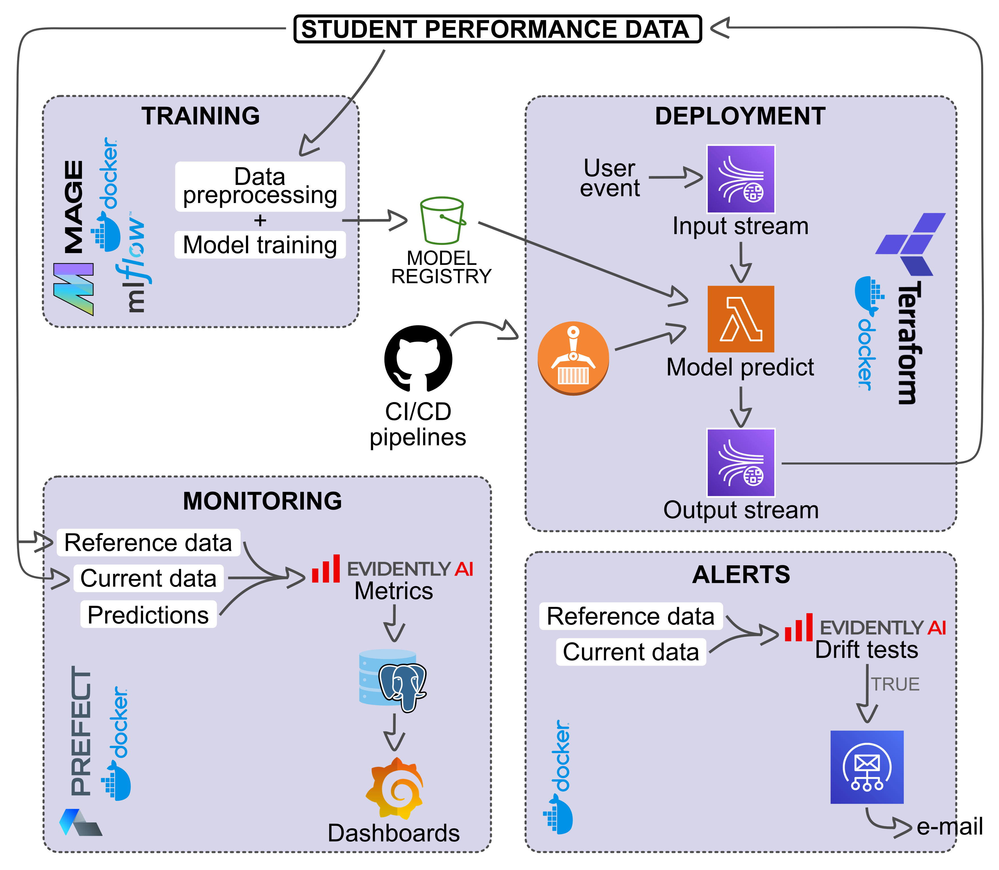

The project is divided into several components:

1. **Training Pipeline:**
    - Managed by an orchestrator, Mage.
    - Models and related artifacts will be saved to Amazon S3 for later use.

2. **Inference Pipeline:**
    - Consumes the saved models for predictions.
    - Can be implemented via Streaming or Flask Web Service. The Streaming method will be deployed in the cloud with full automation.
    - This part will be tested locally using Makefiles.

3. **Monitoring:**
    - Includes monitoring capabilities using Evidently and Grafana.

4. **Infrastructure and Automation:**
    - Terraform will be used for automation and infrastructure management.

5. **CI/CD Workflows:**
    - Includes code quality checks in the CI workflow to ensure high-quality code.
    - Incorporates both unit and integration tests in the CI workflow to ensure robustness and reliability, facilitating seamless deployment of code and container images to the cloud via the CD workflow.

### Before You Start

1. **Set Up the Virtual Environment:**

    1. To create the virtual environment:
        ```bash
        python -m venv .venv
        ```
        You can also set it up through VS Code.

    1. To activate it and add the project path to the PYTHONPATH:

        - In Linux:
        ```bash
        source .venv/bin/activate
        echo "export PYTHONPATH=$PWD" >> .venv/bin/activate
        ```

        - In Windows CMD:
        ```cmd
        .venv\Scripts\activate.bat
        echo set PYTHONPATH=%CD% >> .venv\Scripts\activate.bat
        ```

    1. **Install Dependencies:**
        ```bash
        pip install -r requirements.txt
        pip install -r monitoring_requirements.txt
        ```

1. **Set Up Environment Variables:**

    - An `example.env` file is provided with the environment variable names and brief explanations. Fill these in a new file called `.env`.

1. **Configure AWS Credentials:**

    - Download an access token using AWS IAM. For more information, read the [AWS IAM guide](https://docs.aws.amazon.com/IAM/latest/UserGuide/id_credentials_access-keys.html). You can set the credentials either by adding them to the AWS CLI configuration or by specifying them individually for each service in the `.env` file. The first method is recommended for easier local script usage.


### Technologies

- **Python and Shell Script**: Programming
  - Dev libraries: `black`, `pytest`, `isort`, `pylint`
  - ML libraries: `sklearn`, `pandas`, `numpy`
- **Git and GitHub Actions**: Code versioning and CI/CD
- **MLFlow**: Model tracking and registry
- **AWS**: Cloud provider
  - **Lambda with ECR**: Model serving
  - **Kinesis**: Event streaming
  - **S3**: Data and MLFlow artifact storage
  - **Others**: IAM, CloudWatch
- **Terraform**: Infrastructure as Code (IaC)
- **Mage**: Training orchestration pipeline
- **Docker and docker-compose**: Create and manage containers
- **Evidently and Grafana**: Monitoring
- **Other**: LocalStack, Makefile, `pyproject.toml`, Pre-commit

## Data Preprocessing and Model Training with Mage

All preprocessing and model training runs in Mage. For more details, refer to the [research notebook](research.ipynb).

### Pipelines

1. **Data Preprocessing:**
    - Demographic columns are dropped to avoid bias in production, keeping only the necessary columns.
    - Ordinal categorical columns (e.g., `ParentalEducation`, `ParentalSupport`) and numerical columns with uniform distribution (e.g., `StudyTimeWeekly`, `Absences`) are scaled using `MinMaxScaler` from `sklearn`. The scaler is saved in MLFlow as an artifact for the run.

    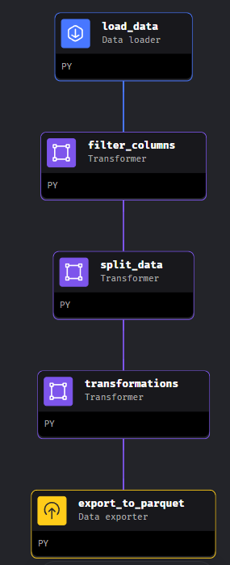

2. **Model Training:**
    - Hyperparameter tuning is performed on the training set for several models.
    - The best model is selected based on validation set performance, measured by `f1-macro` due to unbalanced categories.
    - The chosen model is registered and saved to S3.

    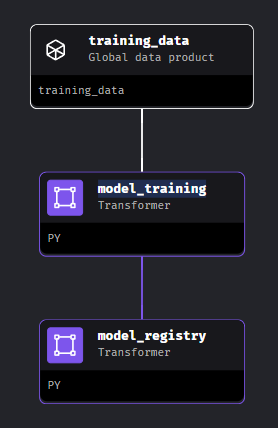

### How to Use

1. **Download the Data:**
    - Download the dataset from [Kaggle: Students Performance Dataset](https://www.kaggle.com/datasets/rabieelkharoua/students-performance-dataset).
    - Place the CSV file in a folder named `data` in the project directory and rename it to `Student_performance_data.csv`.

1. **Set Up AWS Credentials:**
    - AWS credentials are needed to connect with Mage.
    - Add the secrets in the [Mage io_config](orchestrator/student-performance/io_config.yaml) via environment variables or by hardcoding them. For more information, refer to the [Mage documentation](https://docs.mage.ai/production/deploying-to-cloud/secrets/AWS#working-with-secrets-in-mage).

1. **Create .env**:
    - In the [orchestrator folder](orchestrator), create a `.env` file
    - Add `PROJECT_NAME=<project_name>`

1. **Run Docker Compose:**
    - From the [orchestrator folder](orchestrator), run the following command in the terminal to start the MLFlow and Mage servers:
      ```bash
      docker-compose up -d
      ```

1. **Access Mage and MLFlow:**
    - Visit `http://localhost:6789/` to access the Mage UI.
    - Optionally, visit `http://localhost:5000/` to check if MLFlow is running correctly.

1. **Run Pipelines in Mage:**
    - In Mage, go to pipelines and run the preprocessing pipeline to generate data for training the model.
    - Run the model pipeline to save the best model automatically in the S3 bucket, along with its version, the preprocessing model, and the results of all experiments.

1. **Verify S3 Bucket:**
    - Ensure that the experiment folder `1` is present in your S3 bucket.


## Inference Pipeline: Model Serving

The inference pipeline utilizes the trained and saved model to predict the GPA for users based on their input. This section outlines two methods for deploying the inference pipeline: Web Service and Streaming.

### Web Service

Deploying a Flask app on an EC2 instance allows the system to receive user requests through an endpoint and send responses back via a frontend. This method has been developed locally but has not yet been deployed. It remains a potential future option.

- **Deploy Locally:**
  - To deploy the Flask app locally:
    ```bash
    make run_flask
    ```
  - To deploy the Flask app locally with MLFlow experiment tracking:
    ```bash
    make run_flask_with_mlflow
    ```
  - To test the Flask app locally:
    ```bash
    make run_web_test
    ```

### Streaming

The final deployment of the project leverages a serverless event-driven architecture using AWS Kinesis to handle user events and provide responses.

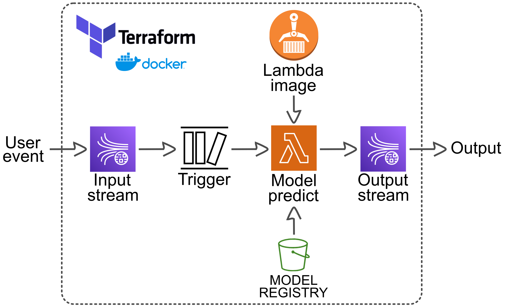

More details in [terraform: IaC](#infrastructure-as-code-with-terraform)

I have chosen this method for its scalability and efficiency. The deployment code's Lambda function is dockerized to ensure seamless cloud deployment. You can find the Dockerfile [here](deployment/streaming/Dockerfile), which includes all necessary utility dependencies.

The streaming approach is run and tested in:

- **Locally**: [Integration tests](#integration-tests).
- **Production**: [terraform](#infrastructure-and-automation-terraform-infrastructure-as-code) and [CI/CD Pipeline](#cicd-pipeline)

### Common Elements

In both the Web Service and Streaming methods, the scaler and model are retrieved from the model registry developed during the research phase and uploaded to S3. This can be achieved using MLFlow or Boto3, avoiding the need to upload the database to load the artifacts.

## Monitoring: Model Maintenance

This module provides a comprehensive system for monitoring data drift in production and triggering alerts to retrain the model when necessary. It integrates various tools to ensure effective tracking and response to changes in data patterns and model performance.

### Overview

The monitoring system consists of several components:

- **Grafana**: For creating and displaying dashboards.
- **Evidently**: For calculating metrics and triggering alerts.
- **Prefect**: For orchestrating workflows.
- **Postgres**: For storing data.

For alerts, **Evidently** handles drift detection, while **SES** (Simple Email Service) is used for sending notifications.

### Dashboards

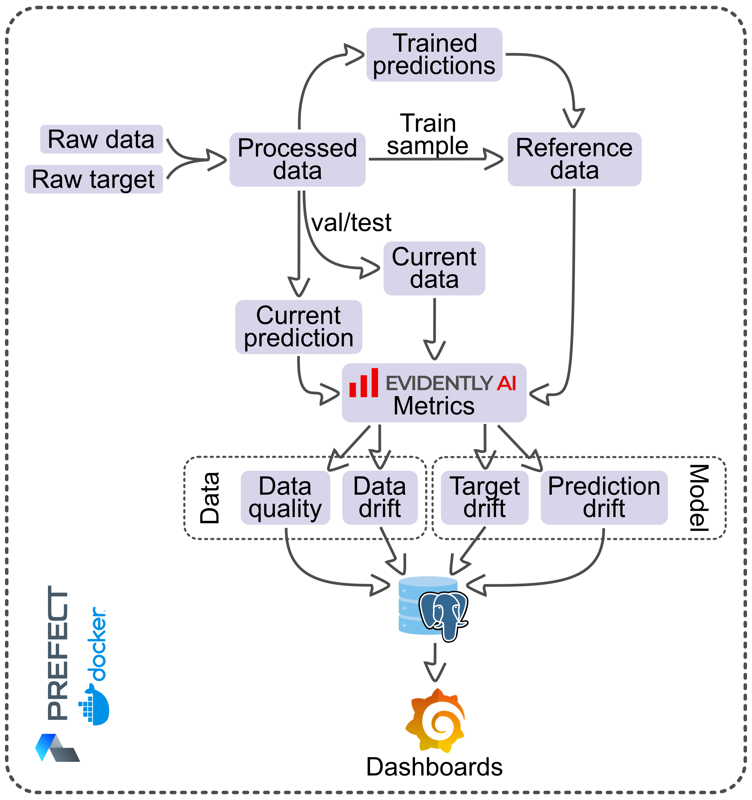

The dashboard monitoring process is divided into two main parts:

1. **Reference Data Preparation:**
   - Calculates and stores reference data from the training set.
   - Implemented in [prepare_reference_data.py](monitoring/src/pipelines/prepare_reference_data.py).

2. **Monitoring Incoming Data:**
   - **Data Pipeline**: Compares incoming batch data with the reference data, calculates metrics, and generates reports.
   - **Model Pipeline**: Calculates predictions, compares them with targets, calculates performance metrics, and updates dashboards.

To manage datetime operations, data adaptation includes joining `x` and `y` with a synthetic timestamp and a UUID for each row.

#### Results

Metrics and visualizations are based on the validation dataset, analyzed in 15-minute batches, each consisting of 15 records. Key points to note:

- **False Positives/Negatives**: High due to limited sample sizes and incomplete model training.
- **Prediction Drift**: Significant changes observed, while target drift remains minimal.

Refer to the images below for visual insights:


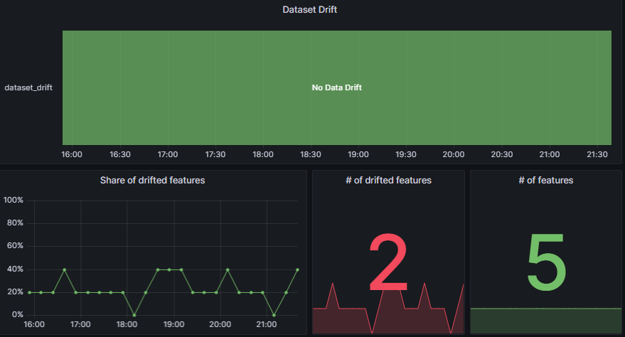
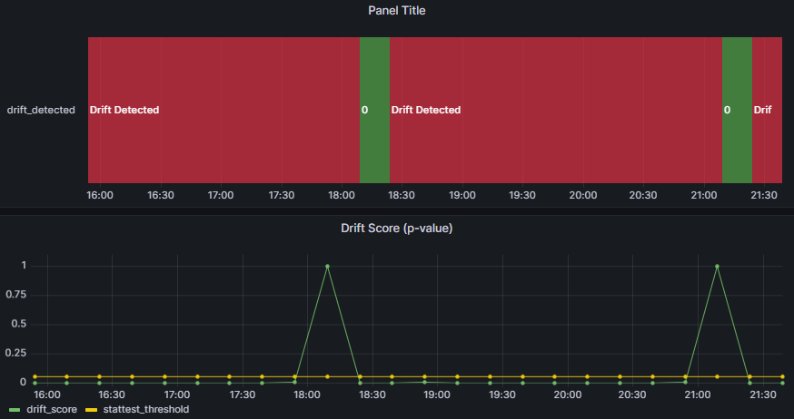
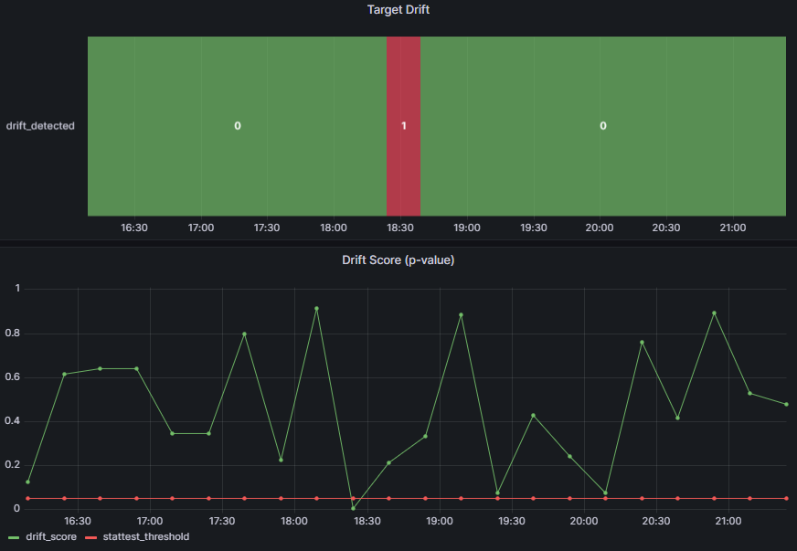

The high percentage of drifted features might indicate a need for further investigation, especially if the drift is not sample-related.

For detailed instructions and additional usage information, please refer to the [monitoring README file](monitoring/README.md#code-modules).

### Alerts

Alerts are designed to trigger in response to detected data drift. The process includes:

1. **Data Arrival**: A new batch of input data triggers the pipeline.
2. **Data Comparison**: The new data is compared with the reference data using Evidently Tests.
3. **Drift Detection**: If drift is detected, an alert is triggered.
4. **Notification**: SES sends an email alert to the specified recipients.

The initial implementation uses static data, with the same reference and current data as described in the previous section. SES is mocked through LocalStack, and sensitive information such as email addresses is stored in the `.env` file.

#### How to Use

1. Ensure that the `.env` file contains correctly configured variables: `SENDER_EMAIL`, `RECIPIENT_LIST`, `PROJECT_NAME`, and `LINK_URL`.
2. Navigate to the `monitoring_alerts` folder and run:
   ```bash
   docker-compose up
   ```

   to deploy LocalStack SES.

3. From the project folder, execute:
   ```bash
   make run_monitoring_alert
   ```
   This command verifies the sender (SENDER_EMAIL), runs the monitoring alert code, and checks if the email alert is successfully sent.

For demonstration purposes, the validation data is intentionally modified to trigger drift.

Example of an alert email:

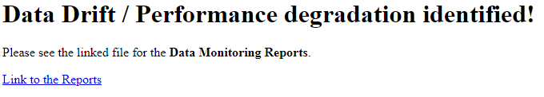

## Infrastructure as Code with Terraform

This project uses Terraform to manage and automate infrastructure deployment. This approach ensures consistency across environments and simplifies resource management.

### Environment Configurations

I maintain two primary environments:

- **Stage**: For testing changes before production deployment
- **Production**: For the live product

This separation allows for safe testing and validation before affecting the production environment. For larger projects, consider adding additional environments like `local` and `dev`.

### Terraform Modules


The infrastructure is composed of four main modules:

1. **ECR**: Manages the Elastic Container Registry for storing Lambda function images.
2. **Kinesis**: Sets up two Kinesis streams for input and output data processing.
3. **Lambda**: Configures the Lambda function, including IAM roles and Kinesis trigger.
4. **S3**: Creates a bucket for storing MLflow artifacts.

### Deployment Instructions

1. **Verify AWS Credentials**: Ensure your AWS credentials are correctly configured.

2. **Initial Setup**:
   - Comment out the `terraform` block in `infrastructure/main.tf`.
   - Run the following commands:
     ```
     terraform init
     terraform plan -var-file=vars/<config_name>.tfvars
     terraform apply -var-file=vars/<config_name>.tfvars
     ```
   Replace `<config_name>` with either `stg` or `prod`.

   Output:

   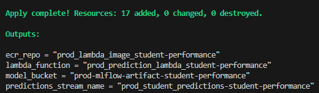

3. **State Management**:
   - Create an S3 bucket for storing Terraform state.
   - Upload the generated `terraform.tfstate` to this bucket, renaming it to `<config_name>-terraform.tfstate`.

4. **Update Terraform Configuration**:
   - Uncomment the `terraform` block in `infrastructure/main.tf`.
   - Update the `bucket`, `key`, and `region` to match your S3 bucket details.

5. **Verify Configuration**:
   - Re-run the Terraform commands from step 2 to ensure everything is configured correctly.

### Notes

- The ECR module's `main.tf` contains image build code optimized for Linux. For Windows systems, use the commented code provided in the file.
- Always review the planned changes before applying them, especially in the production environment.
- Consider implementing additional safeguards and approval processes for production deployments as your project scales.


## Development Practices

This section outlines the development practices and tools used in this MLOps project to ensure code quality, consistency, and ease of use.

### Code Quality Tools

I use the following tools to maintain code quality and consistency:

- **isort**: Automatically sorts and formats import statements.
- **black**: Provides opinionated code formatting to ensure a consistent style across the project.
- **pylint**: A static code analysis tool that checks for errors and enforces a coding standard.

To run these tools, activate your virtual environment and execute the following commands:
```bash
isort .
black .
pylint --recursive=y .
```
It's recommended to run these tools before committing changes to ensure code quality and consistency.

### Makefile
While Makefiles are traditionally used for compiled languages, I utilize one in this Python-based MLOps project to centralize and simplify common commands, particularly for the inference pipeline.

This Makefile is designed to work in the Windows Command Prompt. Before using it, ensure that:

1. Your virtual environment is correctly set up and activated.
2. The PATH_TO_GIT_BASH variable at the beginning of the Makefile is set to your Git Bash installation path.

The Makefile contains commands for various MLOps tasks, including:

- Data preprocessing
- Model training
- Model evaluation
- Inference pipeline execution
- Monitoring
- Development practices

To use the Makefile, simply run:

```bash
make <target>
```

Where `<target>` is the specific command you want to execute.
For a complete list of available commands, refer to the Makefile in the project root.

### Pre-commit Hooks
I use pre-commit hooks to ensure code quality before pushing changes to the repository. While similar checks can be implemented using GitHub Actions, I've chosen to use pre-commit hooks for easier local testing before pushing code.
Most of the hooks are configured to run at the pre-push stage due to their execution time, with only essential checks running at the pre-commit stage.

#### Setup

1. Install the pre-commit and pre-push hooks:
```bash
pre-commit install --hook-type pre-commit --hook-type pre-push
```

2. To manually run all pre-push hooks:

```bash
pre-commit run --all-files --hook-stage pre-push
```
Note: On Windows, if you encounter issues with the pytest hook not recognizing bash, use the custom Make command:
```bash
make run_precommit_push
```


#### Configured Hooks
The .pre-commit-config.yaml file includes the following hooks:

- Code formatting (black, isort)
- Linting (pylint)
- Static type checking (mypy)
- Unit tests (pytest)

Refer to the .pre-commit-config.yaml file for the complete configuration.


## Testing
This project maintains a comprehensive test suite to ensure the reliability and correctness of the MLOps pipeline.

### Unit Tests
The unit tests focus on ensuring the correct functionality of the ModelServing class in the model_serving module.

Key test cases in `test_model.py` include:

- **test_base64_decode**: Verifies correct decoding of Kinesis-encoded input data
- **test_preprocessing**: Tests the preprocessing step using a mocked scaler
- **test_predict**: Validates the prediction method using a mocked model
- **test_lambda_handler**: Ensures the entire Lambda handler workflow functions correctly with mocked components

To run unit tests:

- On Windows:
```bash
make run_unit_tests
```
Or manually:
```bash
export PYTHONPATH=. && python -m pytest .\tests\unit_tests\
```
Note: Setting PYTHONPATH is crucial due to the project's folder structure.


### Integration Tests

The integration tests validate the end-to-end flow of the MLOps pipeline, which involves receiving input data from Kinesis, processing it through a Lambda function, and returning predictions to another Kinesis stream. These tests ensure that the connections between services are functioning correctly.

The integration test suite is divided into two main components:

1. **test_docker.py**:

   - Tests the Lambda function deployed in a container
   - Posts a sample kinesis_event to the input Kinesis stream
   - Triggers the Lambda function
   - Waits for and validates the response


1. **test_kinesis.py**: verifies that the Kinesis output stream correctly receives the prediction event after the Lambda function execution

A shell script `run.sh` streamlines the testing process. This script automates the following workflow:

1. Builds the Dockerfile from deployment/streaming if no LOCAL_IMAGE is provided
1. Activates the virtual environment
1. Runs the docker-compose to create or start the LocalStack (simulating Kinesis) and Lambda containers
1. Creates the Input Kinesis Stream
1. Executes test_docker.py and test_kinesis.py

#### Important Notes:

- The project root is used for the Dockerfile build to avoid issues with the COPY command
- The script references files in different locations, including docker-compose.yaml, the .venv folder, and the Dockerfile

**To run the integration tests on Windows:**
```bash
make run_integration_tests
```
This command executes the entire integration test suite, providing a comprehensive validation of the MLOps pipeline's functionality.

## CI/CD Pipeline

The CI/CD pipeline integrates the infrastructure and good practices sections, streamlining the deployment of new features.

This pipeline is designed for a workflow where direct pushes to the main branch are not allowed. While direct pushes to the develop branch are possible, it is generally better to push to a feature branch first and then create a pull request to develop.

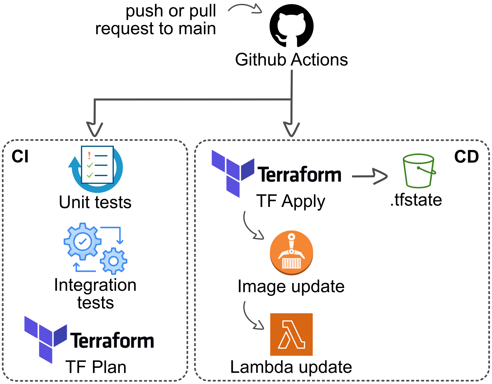

The pipeline consists of two parts:

- **CI Pipeline**: Runs on pushes to the develop branch to ensure everything is functioning correctly.
- **CD Pipeline**: Runs on pull requests to the main branch and deploys changes directly.

Both pipelines are triggered only if files affecting any phase of the pipeline are changed or created. This is managed by specifying paths that need monitoring.

CI/CD pipelines work together, as a reliable CI pipeline is essential for confidently deploying changes to production.

### CI Pipeline
The CI pipeline ensures the system operates correctly when new features are added. It tests all code through unit and integration tests, and verifies the Terraform infrastructure by running terraform plan with production variables and the production backend state.

This pipeline is triggered by pull requests to the main branch or pushes to the develop branch, as these actions are critical for monitoring in this workflow.

The code for the CI pipeline can be found in the [CI pipeline configuration](.github/workflows/ci-tests.yml).

### CD Pipeline

The CD pipeline enables seamless integration of new changes into the production system. It runs the terraform apply steps in production, saves the Lambda image in the ECR, and updates the Lambda function.

This pipeline is triggered only when a pull request to the main branch is accepted, as this is the appropriate moment to deploy the previously implemented changes to production.

The code for the CD pipeline can be found in the [CD pipeline configuration](.github/workflows/cd-deploy.yml).

### Notes

- You need to add AWS Credentials: in the repository's secrets configuration section, add `AWS_ACCESS_KEY_ID` and `AWS_SECRET_ACCESS_KEY`.
- The pipelines are triggered automatically based on the actions mentioned above.
- For testing workflows without Pull Requests temporarily modify the configuration file as follows:

```yaml
on:
  push:
    branches:
      - 'main'  # Replace with the name of your branch
```
This modification allows the workflows to be triggered on pushes to the specified branch, facilitating easier testing.

## Future steps
- Migrate the Training Pipeline to the cloud for improved scalability and resource management.
- Deploy the web service to make predictions accessible via API endpoints.
- Add the web service to the first event streaming pipeline for real-time data processing.
- Implement automated model retraining when data drift surpasses a predefined threshold, instead of only generating alerts.
- Deploy the monitoring module to track model performance and data drift in real-time.
- Complete the implementation of dynamic data ingestion in the monitoring module for more flexible data handling.
- Finish the integration between the monitoring dashboard and alert system for comprehensive performance tracking and notification.
