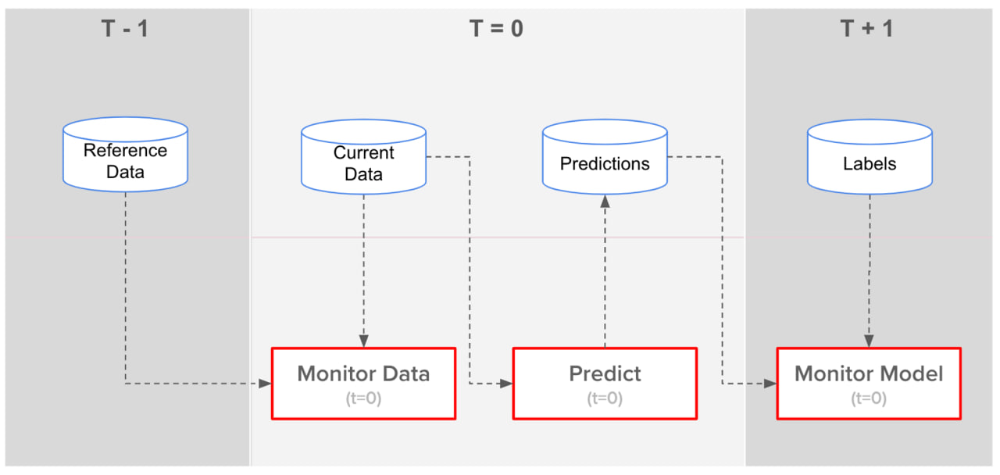

# Monitoring

## Index

- [Introduction](#introduction)
- [Code Modules](#code-modules)
- [How to use](#how-to-use)

## Introduction

This module is the base for deploying a monitoring system for data drift in production along with the model, and trigger alerts to retrain the model. To do this: I have used Grafana for the dashboards, Evidently for metrics calculations, Prefect for orchestration and Postgres as database.

This consist in 2 parts:
- Calculate and store the reference data from the training set. [prepare_reference_data.py](monitoring/src/pipelines/prepare_reference_data.py)
- Monitoring the incoming batch data:
    - **Data Pipeline**: compare the input data to the reference data, calculate metrics and plot the report.
    - **Model Pipeline**: calculate the predictions, compare them to the target, calculate metrics about the comparison and plot the dasboards

To perform datetime operations here, I had to implement a data adaptation where I join the x, y and added a synthetic timestamp with a generated uuid for each row.

## Code modules

- **config**: postgres database configuration based on the environment variables
- **grafana**: grafana configuration and dashboards
- **prefect**: folder where the prefect database of the works and flows is saved. This will need to be deleted if sqllite connection error in the prefect container.
- **src**:
    - **monitoring**: base function for the two monitoring pipelines: data and model
    - **pipelines**:
        - **adapt_data.py**: joined x and y data, added Timestap based on the current time and substract one minute to add the timestamp per row along the test, val, train in that order, and added uuid column. It saves the data as processed_{filename} in the data/features folder. The data that is expected is already preprocessed.
        - **prepare_reference_data.py**: gets the train data, get a sample from it, predicts the target, and add it to the original df. It saves this at `data/reference/reference_data.parquet`.
        - **predict.py**: gets the validation processed data, filter it by date using an end_time and an interval in minutes, and return the predictions. The predictions are saved in a parquet, that will append the incoming predictions. You need to delete this parquet to clean the historical data.
        - **monitor_data.py**: get the evidently reports using the training data as reference and the validation as the current, using an end_time and an interval in minutes to filter the rows. It converts the metrics and saved them into the postgres database
        - **monitor_model.py**: get the evidently reports using the training prediction and target as reference and the validation ones as the current, using an end_time and an interval in minutes to filter the rows. It converts the metrics and saved them into the postgres database
        - **scheduler.py**: Based on 2 variables, interval and start and end datetime, set at the beginning of the run the script it calls predict, monitor_data and monitor_model following the next schema got from evidently:

        

    - **scripts**: for creating or deleting the postgres database
    - **utils**:
        - **db_utils**: functions about the postgres database
        - **models**: "Database Table model" for the metrics got by each evidently Report
        - Rest: for timestamps filtering and type conversions

## How to use:

- There are 2 shell scripts:
    - **run_locally.sh**: runs all the workflow to run the monitoring pipelines completely
    - **reset.sh**: resets all the databases and data for distinct runs

    For Windows, from the cmd you can run: `make run_monitoring` or `make run_monitoring`

- The user only needs to run the .py inside pipelines for the monitoring steps or scripts for the database.

- **Docker Compose**: it deploys Grafana (port 3000), Postgres Database(port 5432) and Prefect(port 4200)
